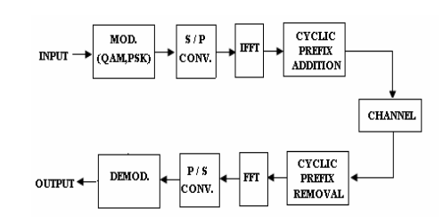

# OFDM Transceiver Simulation

16QAM modulation adopted from [16 QAM Communication Toolbox ](https://16qam-system.readthedocs.io/en/latest/index.html) 



I designed an OFDM transceiver that takes the form of the figure above which I took up from [block diagram link](https://www.researchgate.net/figure/Block-diagram-showing-a-basic-OFDM-transceiver_fig1_47619650). 

## Cloning this Sub-directory
```bash
git clone --depth 1 --filter=blob:none --sparse \
          https://github.com/kmarulab/sdr-projects.git

cd sdr-projects

git sparse-checkout set ofdm-transceiver
```
## Running the Code
```bash
python3 -m venv venv
source venv/bin/activate
pip install -r requirements.txt
python3 main.py
```